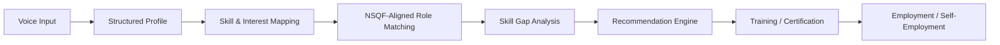

# UNNATIAI

### AI-Powered Voice Assistant for Livelihood Mapping & NSQF-Aligned Skilling

> From Voice → Skills → Skill Gap → Recommendation → Livelihood Pathway

[](https://react.dev/)
[](https://www.typescriptlang.org/)
[](https://vitejs.dev/)
[](https://tailwindcss.com/)
[](https://nodejs.org/)
[](https://fastapi.tiangolo.com/)
[](https://www.mongodb.com/)

---

## 1. Project Overview

**UNNATIAI** is a voice-first livelihood and skilling assistance platform engineered to transform spoken beneficiary conversations into structured livelihood profiles, identify skill gaps against occupational standards, generate explainable recommendations, and guide beneficiaries toward accredited training, certification, wage employment, or micro-enterprise pathways.

Designed with an emphasis on vernacular accessibility, UNNATIAI eliminates complex digital form filling through interactive, conversational voice dialogue. The system bridges informal grassroots experience and formal qualification frameworks, enabling job seekers and rural artisans to discover verified skilling programs and hyperlocal livelihood opportunities.

---

## 2. Problem Statement

Skill development and livelihood initiatives often face critical operational bottlenecks at the grassroots level:

- **Difficulty of Capturing Informal Skills & Experience:** Rural and semi-urban workers frequently possess valuable practical capabilities (e.g., motor repair, farm equipment handling, domestic electricals) acquired through informal apprenticeship, yet lack formal certifications or structured resumes.
- **Barriers Created by Form-Heavy Digital Portals:** Conventional skilling registries demand high digital and textual literacy, presenting dense forms and English-heavy interfaces that deter eligible candidates.
- **Mismatch Between Existing Skills and Training Programs:** Beneficiaries are frequently enrolled in generic or mismatched courses without prior assessment of foundational competencies or local market relevance.
- **Difficulty Identifying Skill Gaps:** Candidates lack clear visibility into what exact competencies separate their current abilities from industry-certified job roles.
- **Difficulty Connecting Training to Measurable Livelihood Outcomes:** Training programs often terminate without transparent, accessible pathways to wage employment or subsidized self-employment opportunities.

---

## 3. Solution Pipeline

UNNATIAI addresses this challenge through an end-to-end multi-stage pipeline:



### Pipeline Stages

1. **Voice Input:** Beneficiaries speak naturally in their native language (Hindi, Marathi, Hinglish, or English) using browser-native Web Speech API.
2. **Structured Profile Extraction:** Natural Language Processing (FastAPI microservice or Node.js fallback) parses spontaneous speech into verified attributes: education, location, work experience, and mobility constraints.
3. **Skill & Interest Mapping:** Spoken competencies and expressed aspirations are categorized into structured domains (IT, Agriculture, Electronics, Services).
4. **NSQF-Aligned Role Matching:** The profile is benchmarked against National Skills Qualification Framework (NSQF Levels 3–5) role specifications.
5. **Skill Gap Analysis:** The engine compares current competencies against target role standards, highlighting mastered skills and isolating missing modules.
6. **Transparent Recommendation Engine:** A multi-factor scoring formula matches beneficiaries to verified courses based on education, skills, interests, district proximity, and livelihood preference.
7. **Accredited Training & Certification:** Beneficiaries receive actionable details on subsidized training centers, course duration, and monthly stipends.
8. **Employment / Self-Employment Linkages:** Candidates are guided toward wage jobs or self-employment toolkits supported by enterprise subsidy schemes (e.g., PM-AJAY, MUDRA).

---

## 4. Key Features

- **Voice-First Conversational Dialogue:** Interactive, multi-turn voice interface with real-time waveform visualization, live transcript display, and text-to-speech feedback.
- **Bilingual & Vernacular Support:** Full UI and voice localization across Hindi (`hi`), Marathi (`mr`), and English (`en`).
- **Explainable Recommendation Scoring:** Complete mathematical score breakdown (Education 20%, Skills 30%, Interests 20%, Proximity 15%, Job Type 15%) showing exactly *why* a course was recommended.
- **NSQF Competency Gap Matrix:** Visual breakdown of mastered vs. missing competencies for occupational standards such as Solar Technicians, Web Assistants, and Electrical Fitters.
- **Dual Livelihood Pathways:** Tailored tracks for both wage employment (salary ranges, district proximity) and micro-enterprise/self-employment (startup toolkits, government scheme links).
- **Interactive Evaluator Demo Tour:** Built-in floating walkthrough controller (`useDemoMode`) allowing evaluators to step through the entire beneficiary journey with one click.
- **Administrative & District Analytics Dashboard:** Regional skilling demand charts, skill-gap heatmaps, beneficiary tracking, and post-placement outcome verification.
- **External Official Ecosystem Gateway:** Direct references to Skill India Digital (SIDH), National Career Service (NCS), NSDC Standards, BHASHINI, and PM-AJAY.

---

## 5. System Architecture

UNNATIAI follows a decoupled, three-tier service architecture with graceful degradation:

```
┌─────────────────────────────────────────────────────────────┐
│                 Frontend Client (Port 5173)                 │
│         React 18 + TypeScript + Vite + Tailwind CSS         │
│   Web Speech API (STT / TTS) • Framer Motion • Recharts     │
└──────────────────────────────┬──────────────────────────────┘
                               │
                               │ REST / JSON (Proxy /api)
                               ▼
┌─────────────────────────────────────────────────────────────┐
│               Backend API Server (Port 5000)                │
│             Node.js + Express + Mongoose + JWT              │
│       Rate Limiting • Helmet • Role-Based Middleware        │
│       Built-in Rule NLP Fallback Engine                     │
└──────────────┬──────────────────────────────┬───────────────┘
               │                              │
               │ HTTP Proxy (Port 8000)       │ Mongoose ORM
               ▼                              ▼
┌──────────────────────────────┐ ┌─────────────────────────────┐
│   Python AI / NLP Service    │ │       MongoDB Database      │
│      FastAPI + Pydantic      │ │     Port 27017 (unnati)     │
│  Multilingual Extraction     │ │   Users • Profiles • Jobs   │
│  NSQF Skill Gap & Scoring    │ │  Trainings • Recommendations│
└──────────────────────────────┘ └─────────────────────────────┘
```

> **Resilience & Fallback Architecture:** If the Python FastAPI service is offline, the Node.js backend automatically triggers its built-in rule-based NLP parser. If the backend API is unreachable, the React frontend activates built-in mock fallbacks to guarantee uninterrupted evaluation.

---

## 6. Technology Stack

### Frontend Client
- **Core:** React 18 (`18.3.1`), TypeScript (`5.5.3`), Vite (`5.4.2`)
- **Styling:** Tailwind CSS (`3.4.11`), PostCSS, Autoprefixer
- **UI & Animations:** Lucide React icons, Framer Motion (`13.4.6`), Recharts (`3.10.1`)
- **Routing:** React Router DOM (`6.26.2`)
- **Speech Layer:** Web Speech API (`SpeechRecognition` / `webkitSpeechRecognition`, `speechSynthesis`)

### Backend API Service
- **Runtime:** Node.js (CommonJS, Express `4.21.0`)
- **Database ODM:** Mongoose (`8.7.0`) for MongoDB
- **Security:** Helmet (`7.1.0`), CORS (`2.8.5`), Express Rate Limit (`7.4.0`), bcryptjs (`2.4.3`), jsonwebtoken (`9.0.2`)
- **Validation & Utilities:** Express-Validator (`7.2.0`), Axios (`1.7.7`), Morgan (`1.10.0`), Dotenv (`16.4.5`)

### AI / NLP Microservice
- **Framework:** Python 3.10+, FastAPI (`0.115.0`), Uvicorn (`0.31.0`)
- **Data Validation:** Pydantic (`2.9.2`)
- **Network & Environment:** Requests (`2.32.3`), Python-Dotenv (`1.0.1`)

---

## 7. Project Structure

```
unnati/
├── .env.example                  # Consolidated environment template
├── package.json                  # Root npm workspace orchestration script
├── preview.html                  # Standalone zero-dependency interactive demo preview
│
├── frontend/                     # React 18 + TypeScript Web Client
│   ├── package.json
│   ├── vite.config.ts            # Development server with /api proxy
│   ├── tailwind.config.js
│   ├── tsconfig.json
│   └── src/
│       ├── App.tsx               # Primary router and role controller
│       ├── components/           # Navbar, Footer, VoiceRecorder, DemoFloatingBar, etc.
│       ├── context/              # LanguageContext and global state providers
│       ├── data/                 # Static datasets, ecosystem links, and mock sessions
│       ├── hooks/                # useVoiceSession, useDemoMode, useLanguage, useAdmin, etc.
│       ├── pages/                # LandingPage, VoiceJourneyPage, ProfilePage, SkillGapPage,
│       │                         # RecommendationsPage, PathwayPage, OpportunitiesPage,
│       │                         # EcosystemPage, AdminDashboardPage, FollowUpPage
│       ├── services/             # HTTP clients (api.ts, voice.service.ts, auth.service.ts)
│       └── types/                # TypeScript interface definitions
│
├── backend/                      # Node.js + Express API Server
│   ├── package.json
│   ├── server.js                 # Server entry point, middleware, and route mounting
│   └── src/
│       ├── config/               # Database connection (database.js)
│       ├── controllers/          # Voice, Skills, Recommendations, Auth, Admin controllers
│       ├── middleware/           # JWT auth and access verification
│       ├── models/               # Mongoose schemas (User, BeneficiaryProfile, TrainingProgram,
│       │                         # LivelihoodOpportunity, Recommendation, Feedback)
│       ├── routes/               # Modular Express API route declarations
│       └── seed/                 # Database seed script (seed.js)
│
└── ai-service/                   # Python FastAPI NLP & Recommendation Service
    ├── main.py                   # FastAPI server entry point and endpoint routes
    ├── requirements.txt          # Python dependencies
    ├── models/
    │   └── schemas.py            # Pydantic request/response schemas
    ├── nlp/
    │   └── profile_extractor.py  # Regex and heuristic natural language attribute extractor
    ├── recommendation/
    │   └── engine.py             # Multi-factor transparent scoring engine
    └── services/
        ├── skill_analyzer.py     # NSQF role competency standards and gap detector
        └── livelihood_mapper.py  # Wage vs. self-employment journey mapper
```

---

## 8. Installation & Setup

### Prerequisites
- **Node.js:** v18.0.0 or higher
- **npm:** v9.0.0 or higher
- **Python:** v3.10 or higher with `pip`
- **MongoDB:** Local MongoDB instance running on port 27017, or a remote MongoDB Atlas URI

### Step 1: Clone the Repository
```bash
git clone https://github.com/RiteshD11/AI-Driven-voice-Assistant-for-livelihood-Mapping-and-NSQF-Aligned-Skilling-Recommendations.git
cd unnati
```

### Step 2: Install Dependencies

You can install all frontend and backend dependencies using the root helper script:
```bash
npm run install:all
```

Or install dependencies manually within each directory:
```bash
# Frontend dependencies
cd frontend && npm install && cd ..

# Backend dependencies
cd backend && npm install && cd ..

# Python AI Service dependencies
cd ai-service
pip install -r requirements.txt
cd ..
```

---

## 9. Environment Configuration

Copy the root `.env.example` file to create your local `.env` file in `backend/` and `ai-service/`:

```bash
cp .env.example backend/.env
cp .env.example ai-service/.env
```

### Environment Variables Reference

| Variable | Default Value | Description |
|---|---|---|
| `PORT` | `5000` | Port for Node.js Express backend server |
| `MONGODB_URI` | `mongodb://localhost:27017/unnati` | MongoDB connection connection string |
| `JWT_SECRET` | `riteshsecretkeyfortokens` | Secret key for signing JSON Web Tokens |
| `JWT_EXPIRES_IN` | `7d` | Token expiration duration |
| `CORS_ORIGIN` | `http://localhost:5173` | Allowed frontend origin for CORS policies |
| `AI_SERVICE_URL` | `http://localhost:8000` | HTTP URL where the FastAPI AI service is reachable |
| `AI_SERVICE_PORT` | `8000` | Port for the Python Uvicorn server |
| `DEMO_MODE` | `true` | Enables deterministic demonstration mocks and seeded profiles |
| `OPENAI_API_KEY` | *(Optional)* | Key for future LLM generative dialogue upgrades |
| `BHASHINI_API_KEY` | *(Optional)* | Key for future production BHASHINI integration |

---

## 10. Running the Application

For a complete local development setup, run all three services concurrently in separate terminal windows:

### Terminal 1: Backend Server (Node.js)
```bash
cd backend
npm run dev
# Running on http://localhost:5000 (API at http://localhost:5000/api)
```

### Terminal 2: AI / NLP Service (FastAPI)
```bash
cd ai-service
python main.py
# Running on http://localhost:8000 (Docs at http://localhost:8000/docs)
```

### Terminal 3: Frontend Client (Vite)
```bash
cd frontend
npm run dev
# Running on http://localhost:5173
```

### Optional: Seeding the Database
To populate MongoDB with verified demo users and sample beneficiary profiles:
```bash
npm run seed
# or: cd backend && node src/seed/seed.js
```

---

## 11. Core Backend & AI Endpoints

### Backend API (`http://localhost:5000/api`)
- `GET /api/health` — System status and timestamp
- `POST /api/voice/process` — Process raw transcript via NLP pipeline
- `POST /api/voice/session` — Initialize interactive multi-turn dialogue session
- `POST /api/voice/input` — Ingest spoken response and update beneficiary profile
- `POST /api/skills/gap` — Compute competency completion percentage and missing skills
- `GET /api/skills/roles` — Retrieve catalog of NSQF target benchmark roles
- `GET /api/recommendations/list` — Retrieve accredited training program catalog
- `GET /api/recommendations/:userId` — Generate multi-factor scored course recommendations
- `GET /api/recommendations/:id/explanation` — Audit breakdown of match score factors
- `GET /api/pathway` — Sequential 5-stage livelihood progression tracking
- `GET /api/opportunities` — Hyperlocal wage and self-employment listings
- `GET /api/outcomes/employment` — Longitudinal wage uplift and retention metrics

### AI Service API (`http://localhost:8000`)
- `GET /health` — AI microservice health status
- `POST /api/nlp/extract` — Spoken vernacular transcript entity extraction
- `POST /api/skills/gap` — NSQF standard competency gap calculation
- `POST /api/recommend` — Multi-dimensional recommendation scoring engine
- `GET /api/livelihood/map` — Dual wage and self-employment pathway generator

---

## 12. Recommendation Logic & Scoring Formula

Recommendations avoid opaque, black-box decisions. Each match score (scaled from 60% to 98%) is calculated using a transparent weighted multi-factor model:

$$\text{Match Score} = S_{\text{edu}} + S_{\text{skills}} + S_{\text{interests}} + S_{\text{location}} + S_{\text{job\_pref}}$$

| Dimension | Weight | Scoring Criteria |
|---|:---:|---|
| **Education Match** | **20%** | **20 pts** if beneficiary meets or exceeds qualification threshold (e.g. 10th/12th pass); **12–14 pts** for partial or alternative equivalency. |
| **Skill Affinity** | **30%** | **28 pts** if existing spoken skills overlap with course domain tags or computer literacy; **15–16 pts** for baseline entry capability. |
| **Aspiration & Interest** | **20%** | **20 pts** if target course aligns with expressed interest (e.g. Technology, Solar, Agri); **10 pts** for general exploration. |
| **Geographic Proximity** | **15%** | **15 pts** if training center is located in beneficiary's home district (or hybrid); **9–10 pts** if regional commute is required. |
| **Livelihood Preference** | **15%** | **15 pts** if delivery track aligns with preferred outcome (Wage employment vs. Self-employment micro-business). |

Every recommendation returned to the user displays an itemized list of contributing factors (e.g., *"✓ Builds on existing skills in Basic Computing"*, *"✓ Available locally in Varanasi"*).

---

## 13. Security, Accessibility & Consent

- **Explicit Voice Consent:** The dialogue sequence begins with an explicit consent check informing the beneficiary how spoken information is processed.
- **Data Editing & Confirmation:** Extracted profiles are displayed on an editable confirmation screen (`ProfilePage`), preventing automated misinterpretations.
- **Low-Literacy UI Design:** High-contrast design palette, large touch targets, visual progress steppers, and audible text-to-speech output across views.
- **Network Security:** Helmet HTTP security headers, CORS origin whitelisting, and API rate limiting on authentication and processing routes.
- **Privacy Assurance:** No biometric voiceprints are retained; audio input is converted to text directly within the browser session via the Web Speech API.

---

## 14. Current Implementation Status

| Component | Status | Implementation Details |
|---|:---:|---|
| **Voice Interface** | **Working** | Web Speech API recognition & speech synthesis with interactive audio waveform. |
| **Bilingual Support** | **Working** | Dynamic UI and audio switching between Hindi, Marathi, and English. |
| **Profile Extraction** | **Working** | Multilingual extraction microservice (FastAPI) with Node.js fallback. |
| **NSQF Gap Analysis** | **Working** | Competency mapping across 5 target roles with percentage completion. |
| **Recommendation Engine** | **Working** | Transparent multi-factor scoring algorithm with explainable factor tags. |
| **Admin Dashboard** | **Working** | Interactive district analytics, beneficiary tracking, and outcome monitoring. |
| **Demo Tour Controller** | **Working** | Floating step-by-step evaluator navigation across all 10 platform views. |
| **Ecosystem Gateways** | **Working** | Verified external links and disclaimers for SIDH, NCS, NSDC, BHASHINI, and PM-AJAY. |

---

## 15. Planned Production Improvements

- **BHASHINI Unified Speech Integration:** Upgrade from browser-based Web Speech API to official Government of India BHASHINI ASR/TTS endpoints for deeper dialectal recognition.
- **Live National Course Registry Sync:** Direct API integration with Skill India Digital Hub (SIDH) course and center databases.
- **Omnichannel Access Layers:** Extension of conversational flows to WhatsApp Chatbots and IVR (toll-free telephone voice) for feature phones.
- **Gram Panchayat Kiosk Interface:** Touchscreen and kiosk deployment modes for Common Service Centres (CSCs).
- **DigiLocker Credential Verification:** Automated verification of educational credentials and NSQF micro-certifications.

---

## 16. Limitations

- **Browser-Dependent Speech Recognition:** In the current prototype, speech recognition depends on browser engine support for Web Speech API (Google Chrome / Chromium recommended).
- **Simulated External Portals:** Links to government platforms (SIDH, NCS, PM-AJAY) operate as contextual referral gateways; direct two-way API synchronization is scheduled for future phases.
- **Prototype Catalog Scale:** Course catalogs and occupational standards currently cover representative pilot sectors (IT, Agriculture, Electrical Hardware).

---

## 17. External Ecosystem References

UNNATIAI aligns conceptually with official skilling and employment initiatives:

- [Skill India Digital Hub (SIDH)](https://www.skillindiadigital.gov.in/) — National skilling courses and center directory
- [National Career Service (NCS)](https://ncs.gov.in/) — National employment and job matching portal
- [National Skill Development Corporation (NSDC)](https://www.nsdcindia.org/) — National Occupational Standards (NOS) repository
- [BHASHINI Language Mission](https://bhashini.gov.in/) — National language technology platform
- [PM-AJAY Scheme Guidelines](https://socialjustice.gov.in/index.php/schemes/104) — Pradhan Mantri Anusuchit Jaati Abhyuday Yojana

*Disclaimer: UNNATIAI is an independent technology prototype developed for Smart India Hackathon (SIH 2026). Official institutional logos or links are utilized solely for contextual demonstration and reference.*

---

## 18. License

This project is licensed under the [MIT License](LICENSE).
